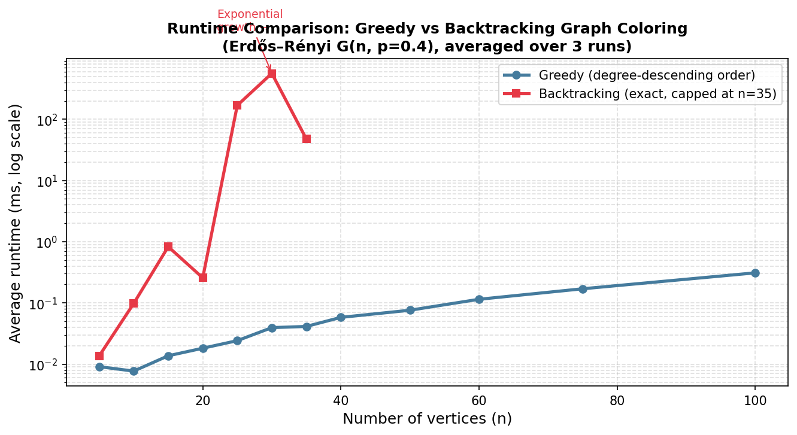
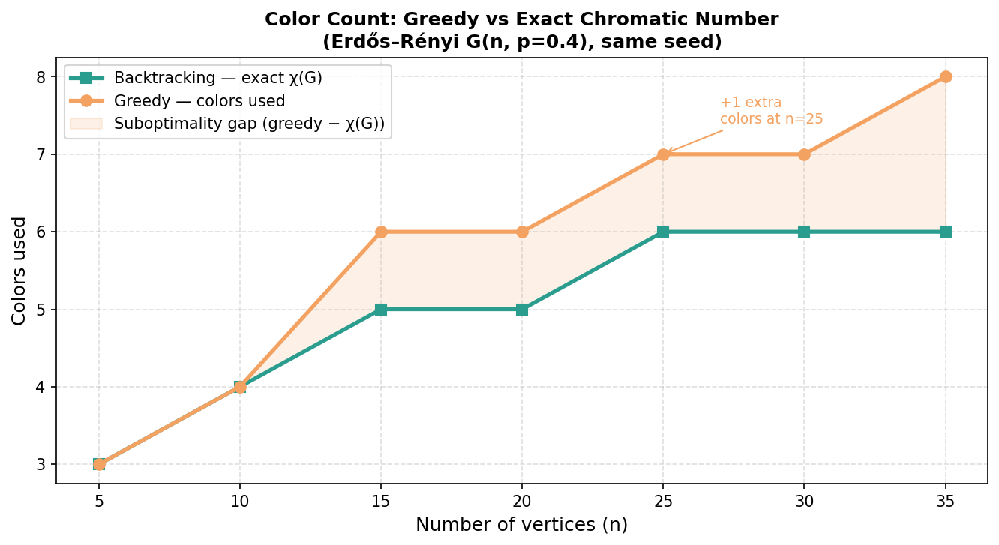
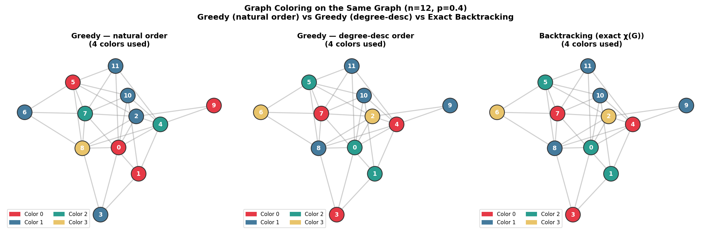

# Graph Coloring Visualizer & Complexity Comparator

Empirically compares **greedy** and **backtracking** graph coloring algorithms, demonstrating the fundamental trade-off between polynomial-time heuristics and exact exponential-time solutions on an NP-hard problem.

## What is graph coloring?

Graph coloring assigns colors to vertices such that no two adjacent vertices share a color, using as few colors as possible. The minimum number of colors needed is the **chromatic number** χ(G).

Finding χ(G) exactly is **NP-hard** — no known polynomial-time algorithm exists for the general case. This project makes that theoretical fact concrete by measuring it empirically.

## Algorithms

### Greedy coloring — O(V + E)
Processes vertices in a fixed order; assigns each vertex the smallest color not used by already-colored neighbors. Fast, but **not optimal** — the number of colors used depends on vertex ordering, not just graph structure.

### Backtracking coloring — O(k^V) worst case
Exhaustive search with pruning: tries to color the graph with k colors, backtracks when stuck, and increments k until a valid coloring is found. **Guarantees χ(G)** but becomes exponentially slow as graphs grow.

## Key findings

| n (vertices) | Greedy colors | Exact χ(G) | Greedy runtime | Backtracking runtime |
|:---:|:---:|:---:|:---:|:---:|
| 10 | 4 | 4 | 0.008 ms | 0.098 ms |
| 20 | 6 | 5 | 0.018 ms | 0.257 ms |
| 25 | 7 | 6 | 0.024 ms | 168.7 ms |
| 30 | 7 | 6 | 0.040 ms | 562.8 ms |
| 35 | 8 | 6 | 0.041 ms | 47.6 ms |

Greedy stays under **0.4 ms** at n=100. Backtracking hits **562 ms** at n=30 and becomes impractical past n=35 — this is the exponential wall in action.

## Figures

**Runtime comparison (log scale):**

**Color count — greedy vs exact χ(G):**

**Colored graph drawings — same graph, three strategies:**

## Why it matters

This project is a self-contained demonstration of a core algorithms concept: the **tractability gap** between heuristic and exact methods on NP-hard problems. Greedy's polynomial speed comes at the cost of optimality; backtracking's correctness guarantee comes at an exponential runtime cost. Both are measurably real, not just theoretical claims.

